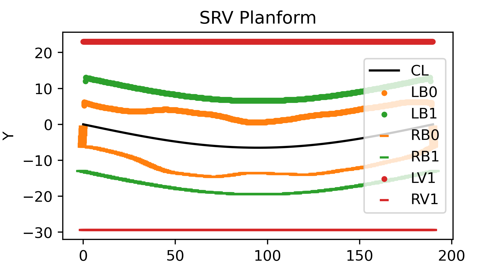
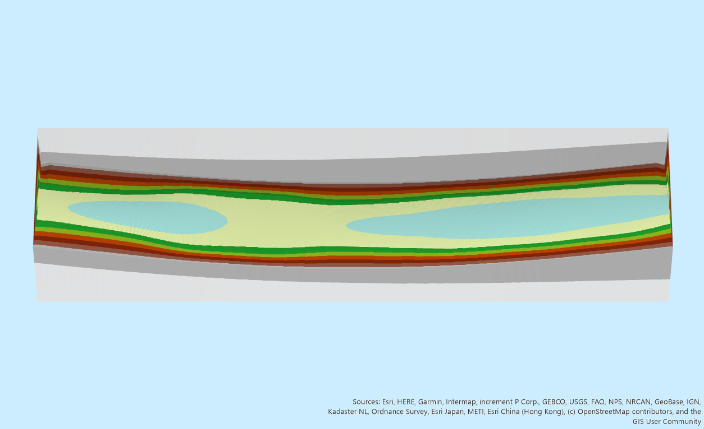

Export to River Builder
++++++++++++++++++++++++

This software can also be used to export channel geometry to `River Builder <https://github.com/RiverBuilder/RiverBuilder>`_.

River Builder is a piece of software that converts geometric variabtity functions to a modeled river 
topography. River Builder takes inputs from a textfile describing desired river geometry using geomeotric variability functions,
and outputs a digital elevation model (DEM) with generated terrain, as well as different plots. 

A variety of geometric variability are supported, and can define longitudinally variable aspects of the channel geomoetry such as 
width oscillations at multiple scales of :term:`nested topography`. A detailed description of all possible River Builder inputs and outputs is beyond the scope of this documentaion, but provided  
`here <https://github.com/RiverBuilder/RiverBuilder/blob/master/RiverBuilder_User_Manual_1.2.0_final.pdf>`_.  

Real world topography to River Builder
======================================
This GUI allows the width (W) and detrended elevation (Z) series extracted by GCS analysis to be converted into River Builder inputs via generating geomeotric variability functions. 

**Background:**

- River Builder can take a list of sine and/or cosine functions and add them together to recreate complex channel geomeotry oscillations. 
- A Fast Fourier Transform (FFT) is a signal processing technique that decomposes an original signal to an additive list of frequencies, which can be represnted as harmonic function.
- An Inverse Fast Fourier Transform (IFFT) takes an additive list of frequencies as an input, and reconstructs the original signal. 

**Processing steps:**

1. A GCS extracted series, for example width (W), is intepreted as a signal and decomposed into the frequency domain using an FFT.

    * FFT output lengths depend on signal length, and can include many harmonic component (> 100 in most cases)
    .. note:: While Width (W) series for all input flow stages are exported, only the detrended elevation (Z) series of only the lowest flow stage is used.
2. Simplified versions of the original signal are generated. An IFFT is created for subsects of the FFT generated frequencies, starting with the first frequency and iteratively adding on others.

    * For example, the first IFFT could construct a signal for 2*sin(4(x − 0.5))  
    * Next the first frequency plus the next one from the FFT decomposition is reconstructed: 2*sin(4(x − 0.5)) + 3*sin(2(x − 0.75))
    * And so on: 2*sin(4(x − 0.5)) + 3*sin(2(x − 0.75)) + sin(x + 0.25)
    * 2*sin(4(x − 0.5)) + 3*sin(2(x − 0.75)) + sin(x + 0.25) + 4sin(3(x + 1.2))
    * 2*sin(4(x − 0.5)) + 3*sin(2(x − 0.75)) + sin(x + 0.25) + 4sin(3(x + 1.2)) + 2sin(x - 4)
3. As frequencies are added, the simularity of the recomposed signals approaches the original signal. At a correlation threshold defined by the input R^2 parameter, frequencies are no longer added. 
4. The final list of frequencies (adding up to be sufficiently correlated with the orignal signal) are converted into periodic functions, and formatted as a River Builder input text file. 

Output text files are saved in a new folder, */River_Builder_inputs*. The user will then have to follow 
`River Builder documentation <https://github.com/RiverBuilder/RiverBuilder/blob/master/RiverBuilder_User_Manual_1.2.0_final.pdf>`_ to generate terrain. 

GUI inputs
===========
- Flow stage elevations separated by commas, ex: *'0.2,0.7,2.6'*

    * Each added flow stage will have it's width (W) series converted into a list of River Builder input functions in a separate text file.
    * The detrended elevation of the River Builder terrain centerline is defined by the lowest flow stage's Z series. 
- R^2 threshold: A float between 0 and 1, ex: '0.78' 

    * Refers to the coefficient of correlation between the original signal, and the reconstructed (IFFT) signal w/ N number of FFT frequencies included.
    * A higher R^2 threshold will mean that more frequencies from the original signal FFT are exported, increasing the complexity of the River Builder terrain. 
- The units used for the anlaysis (Meters or US Feet). 

Outputs
===========

A new folder */River_Builder_inputs* is created to store the following textfiles.

- Textfiles storing River Builder periodic functions (see example below) that represent the width series for each input flow stage, ex: */W_0.4ft_RB.txt*. 
- Textfiles storing the minimum lateral offset of the width function for each flow stage, ex: */W_0.4ft_offset.txt*. 
- A textfile storing River Builder periodic functions for the lowest flow stage's detrended elevation (Z) series, ex: */Z_0.2ft_RB.txt*.

Examples
=========

- A River Builder input file that will be used to define inner channel width.   

.. image:: images/rb_in.png

- An example of a produced River Builder channel planform plot, with two input width series (inner channel in orange, outer channel in green).

- The River Builder generated terrain corresponding to the above planform, in both DEM (top) and TIN (bottom) formats. 

.. image:: images/sfe_dem.png 

